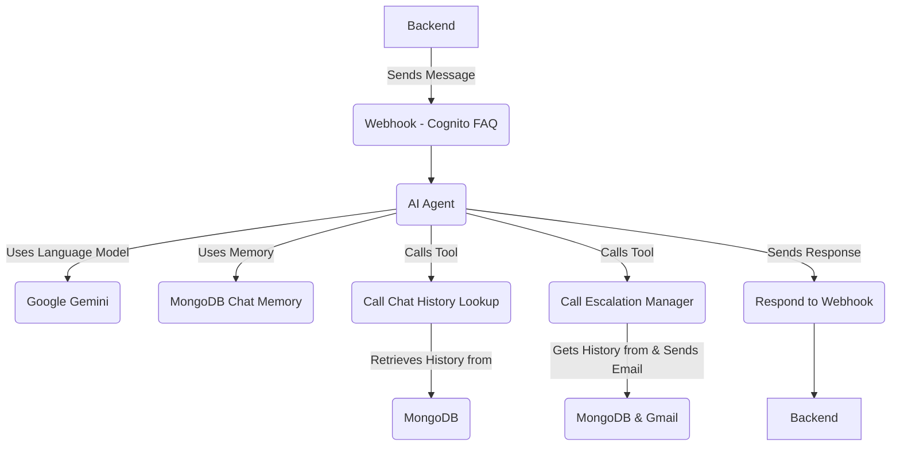
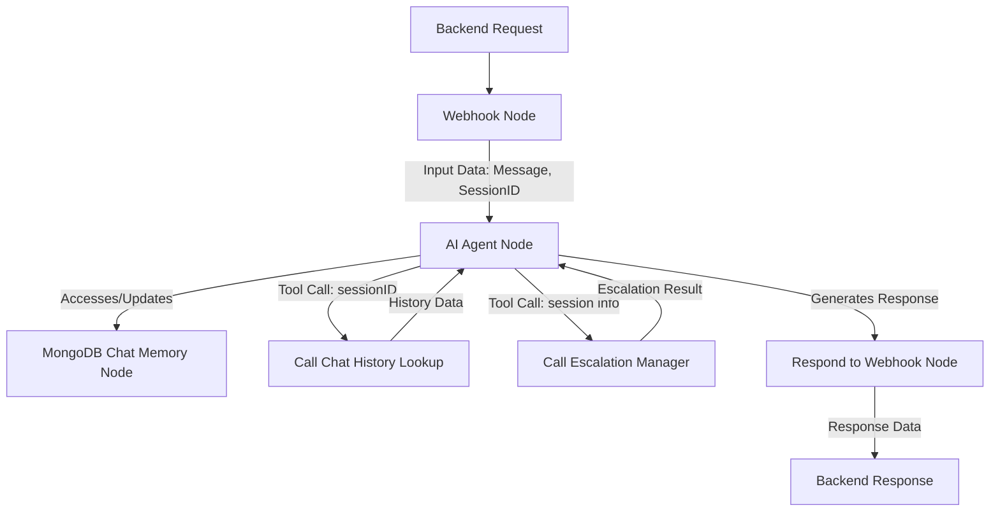

This directory contains the n8n workflow configurations that power the AI capabilities of the Support Bot. These workflows handle everything from answering customer queries to escalating issues to human support when needed.

## Workflow Architecture Overview

This diagram shows the main components and how the primary workflow interacts with external services and other workflows (as tools).



## Technical Deep Dive: Main Workflow (`Cognito_FAQ`)

This diagram illustrates the flow and key node interactions within the primary `Cognito_FAQ` workflow itself, including data flow.



## **📋 Available Workflows**

1. **Chat_History_Lookup.json** - A workflow tool used to retrieve the conversation history for a specific chat session from MongoDB.
2. **Escalation_Handler.json** - A workflow tool that analyzes a chat session to decide if human escalation is needed and, if so, formats and sends an email to the support team.
3. **Cognito_FAQ.json** - The main workflow that receives incoming chat messages, uses an AI Agent powered by Google Gemini and chat memory, and utilizes the other workflows as tools to provide responses or handle escalations based on its System Prompt knowledge base.

## **🚀 Setting Up n8n**

### **Prerequisites**

Before setting up the workflows, ensure you have:

- n8n running (via Docker or standalone installation)
- Access to the services actively used by the workflows:
    - MongoDB (for storing chat history and chat memory)
    - Google Gemini API (for core AI capabilities)
    - Gmail (for sending escalation emails)

***Note: The included workflow JSONs may contain nodes for services like Pinecone, OpenAI Embeddings, and Google Drive. These were part of a previous approach for the knowledge base but are not currently active in the main workflow logic.***

### **Step 1: Access n8n**

If you've launched the application using Docker Compose as described in the main README:

```bash
# Navigate to n8n in your browser
http://localhost:5678
```

Create an account or log in with the default credentials:

- Username: `admin`
- Password: `password`

### **Step 2: Configure Credentials**

Before importing or activating the workflows, you'll need to set up these credentials in n8n for the actively used services:

1. **MongoDB**
    - Go to Settings > Credentials
    - Click "Add Credential"
    - Select "MongoDB"
    - Configure with:
        - Host: `mongodb` (if running n8n within the same Docker network as MongoDB) or `localhost` (if running n8n locally and MongoDB port is mapped)
        - Port: `27017`
        - Database: `support-bot`
    - *Needed by:* Chat History Lookup, Escalation Handler, and the main Cognito FAQ workflow (for chat memory).
2. **Google Gemini API**
    - Add a credential of type "Google PaLM API"
    - Enter your API Key from Google AI Studio
    - [Get a key here](https://makersuite.google.com/app/apikey)
    - *Needed by:* The main AI Agent in the Cognito FAQ workflow and the AI Agent in the Escalation Handler workflow.
3. **Gmail**
    - Add an OAuth2 credential for Google Mail (Gmail).
    - Follow the n8n prompts to authorize the connection to your Google account.
    - *Needed by:* The Escalation Handler workflow to send escalation emails.

***Note: Credentials for Pinecone, OpenAI API (for embeddings), and Google Drive are not required for the current workflow functionality.***

### **Step 3: Import Workflows**

1. From the n8n dashboard, click "Workflows" in the left sidebar
2. Click the "Import from File" button (or press `i`)
3. Select one of the JSON files from this directory 
    1. `N8N/Chat_History_Lookup.json`
    2. `N8N/Escalation_Handler.json`
    3. `N8N/Cognito_FAQ.json`
4. Repeat for each workflow file

### **Step 4: Configure Workflow Settings**

After importing, you'll need to update some settings in each workflow:

### **For Chat_History_Lookup.json**

1. Open the workflow.
2. Check the MongoDB node and ensure the correct credential is selected.
3. Verify the collection names in the MongoDB node's 'Aggregate' query match your MongoDB setup (`sessions` and `messages`).

### **For Escalation_Handler.json**

1. Open the workflow.
2. Check the MongoDB node and ensure the correct credential is selected.
3. In the "Escalate To Team" Gmail node:
    - Update the recipient email to your support team's address (e.g., `support@cognitoedu.org`).
    - Verify the correct Gmail credential is selected and working.

### **For Cognito_FAQ.json (Main Workflow)**

1. Open the workflow.
2. Check the Google Gemini Chat Model node and ensure the correct credential is selected.
3. Check the MongoDB Chat Memory node and ensure the correct credential is selected and the database name matches (`support-bot`).
4. **Configure Workflow Tools:**
    - Locate the "Call Escalation Manager" node (Type: Workflow Tool). Ensure the correct "Escalation Handler" workflow is selected from the dropdown.
    - Locate the "Call Chat History Lookup" node (Type: Workflow Tool). Ensure the correct "Chat History Lookup" workflow is selected from the dropdown.
5. **Configure AI Agent Prompts:** The core behavior and knowledge base of the bot are defined in the "AI Agent" node's **System Prompt** and **User Prompt**. Open this node and review/modify the extensive instructions provided there to tailor the bot's responses, knowledge, and escalation rules.

### **Step 5: Activate the Workflows**

For the Support Bot to function, the **Cognito_FAQ** workflow must be active. The workflow tools (`Chat History Lookup`, `Escalation Handler`) also need to be active for the main workflow to call them.

1. For each of the three imported workflows, click the "Active" toggle in the top-right to enable it.
2. Save each workflow.

## **🔌 Connecting Workflows to the Support Bot**

The Support Bot backend is configured to send initial chat messages to the main **Cognito_FAQ** workflow using a specific webhook URL. Make sure these environment variables are set correctly in your main `.env` file (as described in the main README):

```bash
N8N_WEBHOOK_URL=N8N_WEBHOOK_URL=https://auto.fairytales.dev/webhook/e1f7afe1-6eaf-4d4e-824e-83be04f4607d
N8N_WEBHOOK_URL_DEV=ttps://auto.fairytales.dev/webhook-test/e1f7afe1-6eaf-4d4e-824e-83be04f4607d
```

For local development without Docker, where n8n is accessed via localhost:

```bash
N8N_WEBHOOK_URL=http://localhost:5678/webhook/support-bot-ai
```

Ensure the path (`/webhook/support-bot-ai` or `/webhook/support-bot-ai-dev`) configured in the Webhook node of your **Cognito_FAQ** workflow matches the path in the environment variable used by the backend.

## **📚 Knowledge Base & AI Configuration**

The primary knowledge base and conversational logic for the Support Bot are embedded within the **System Prompt** and **User Prompt** of the **AI Agent node** in the main **Cognito_FAQ** workflow.

- **Current Approach (Prompt-based):** The bot relies on the detailed instructions and examples provided directly in the AI Agent's prompts to understand user queries, access information (like the Cognito FAQ text included in the prompt), decide when to escalate, and format responses.
- **Previous Approach (Vector Search):** The workflow JSONs include nodes for Google Drive, OpenAI Embeddings, and Pinecone. This was an earlier attempt to build a knowledge base using vector search over external documents. This approach was found to be less reliable ("fuzzy") for the specific domain compared to the fine-tuned instructions possible within the prompts, and is currently inactive.
- **Future Plan:** There is a plan to integrate with Notion as a source for knowledge base content, which would then likely be used to dynamically update the AI Agent's context or prompts.

To modify the bot's knowledge or core behavior, you will primarily edit the text within the AI Agent node's prompt fields in the **Cognito_FAQ** workflow.

## **🛠️ Troubleshooting**

### **Workflow Activation Issues**

- Ensure the "Active" toggle is enabled for all three workflows.
- Check for any errors displayed on the workflow nodes themselves.

### **Credential Issues**

- Verify that all required credentials (MongoDB, Google Gemini, Gmail) are configured correctly in n8n Settings > Credentials.
- Ensure the correct credential is selected in the relevant nodes within each workflow.
- Test credentials individually if possible.

### **Workflow Tool Issues (Chat History, Escalation)**

- If the main workflow (`Cognito_FAQ`) fails when trying to use a tool, ensure the called workflow (`Chat History Lookup` or `Escalation Handler`) is Active and that the "Call Workflow" node in the main workflow is configured to point to the correct workflow ID.

### **AI Response Issues (Irrelevant, Slow, Incorrect)**

- Review and refine the **System Prompt** and **User Prompt** in the AI Agent node of the **Cognito_FAQ** workflow. This is where the bot's instructions and knowledge reside.
- Check the execution logs for the AI Agent node for any errors or unexpected inputs/outputs.
- Verify your Google Gemini API key is valid and has sufficient quota.

### **Escalation Email Not Sending**

- Check the execution logs for the **Escalation Handler** workflow.
- Verify the Gmail credential is set up correctly and authorized.
- Ensure the recipient email address in the Gmail node is correct.

### **Webhook Issues**

- Ensure the Webhook node in the **Cognito_FAQ** workflow is active.
- Verify the webhook path configured in the node matches the path in the `N8N_WEBHOOK_URL` environment variable used by the backend.
- Check that n8n is accessible from the backend service's network location (e.g., via `localhost` or `n8n` hostname).

For more help, refer to the [n8n documentation](https://docs.n8n.io/).

## **🔄 Updating Workflows**

After making changes to workflows in n8n:

1. Export the workflow as JSON (click the three dots > Export)
2. Save the JSON file to this directory (`./N8N/`), overwriting the existing file.
3. Commit the changes to version control.

This helps keep your workflow configurations tracked and shareable with the team.