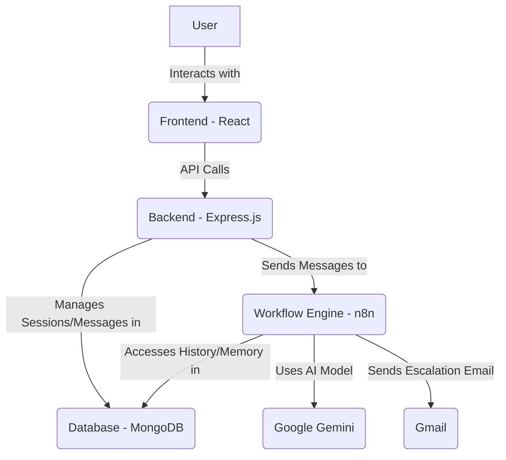

> Because sometimes humans need a coffee break, but customer service never sleeps!
> 

A smart, snappy support chat bot application that leverages n8n workflows to bring AI-powered assistance to your customers. This README focuses on the technical setup and running the project locally using Docker or a local development environment.

## **✨ Features**

- **Smart Conversations**: AI-powered responses powered by customizable n8n workflows.
- **Session Management**: Persistent tracking of customer conversations.
- **Modular Integration**: Designed to plug into workflow engines like n8n.
- **Customizable Workflows**: Define AI logic and integrations using a visual tool like n8n.
- **Automated Cleanup**: Configurable system for removing old chat data.
- **Modern UI**: A responsive React frontend for the chat interface.

## **🏗️ Architecture**

The Support Bot is built with the following key technologies:

- **Frontend**: React 19 with Vite, Tailwind CSS - Provides the customer chat interface.
- **Backend**: Express.js REST API (Node.js) - Handles sessions, messages, and communication with the workflow engine.
- **Database**: MongoDB - Stores chat session and message data.
- **Workflow Engine**: n8n - Executes the AI logic and potential third-party integrations.
- **Containerization**: Docker - Used for easily running dependencies (MongoDB, n8n) or the entire application stack.



## **🛠️ Technical Decisions & Implementation Notes**

### **Development Focus**

- Primary focus was on the n8n workflow integration and Express backend.
- Frontend was developed with rapid UI creation tools.
- MongoDB was chosen for native document database capabilities over an ORM like Prisma.

### **AI Implementation**

- Leverages n8n's capabilities (like the AI Agent module) for workflow automation and decision-making.
- Core AI functionality currently powered by Google Gemini Flash 001, configured within n8n workflows (model is swappable in n8n).
- System and user prompts were developed collaboratively using various AI tools.
- Note: Vector storage with Pinecone was explored but presented challenges with memory retention in this implementation.

### **Data Management**

- MongoDB stores both sessions and messages for persistent chat history.
- A data retention policy is implemented using agenda.js for scheduled cleanup based on age.
- API endpoints are available for manual cleanup management.

## **🚀 Quick Start - Running Locally**

You can run the Support Bot using Docker Compose for all services or by running the frontend/backend locally alongside Dockerized dependencies.

### **Prerequisites**

- Docker and Docker Compose installed.
- Node.js and npm installed (for the "Developer Method").

### **🐳 The Docker Method (Recommended)**

This method uses Docker Compose to run all services (frontend, backend, MongoDB, n8n) in containers.

1. **Clone the repository:**
    
    ```bash
    git clone git@github.com:Eventyret/support-bot.git
    cd support-bot
    ```
    
2. **Create environment file:** Copy the example environment file.
    
    ```bash
    cp .env.example .env
    ```
    
3. **Configure Environment:** Edit the newly created `.env` file with your preferred text editor.
    - At minimum, update the placeholder values for `N8N_ENCRYPTION_KEY` and `CLEANUP_API_KEY` with any non-empty string.
    - The default values in `.env.example` for Docker setup should generally work, but review them.

<aside>
💡

For `CLEANUP_API_KEY` this needs to be set in n8n if you want it to clean things up.

For `N8N_ENCRYPTION_KEY` you can use the following command create a key
`openssl rand -hex 32`

</aside>

1. **Start the services:** Build and run the containers in detached mode.
    
    ```
    docker-compose up --build -d
    ```
    
2. **Access the application:**
    - Frontend (Chat UI): `http://localhost:5173`
    - Backend API: `http://localhost:3000` (Note: Backend listens on port 3000 by default in `.env.example`)
    - n8n Workflow Engine: `http://localhost:5678`

### **🧑‍💻 The Developer Method (Local Frontend/Backend)**

This method runs the frontend and backend directly on your machine while using Docker for MongoDB and n8n.

1. **Clone the repository:**
    
    ```
    git clone <your_repository_url_here>
    cd support-bot
    
    ```
    
2. **Install Dependencies:** This script navigates into the `frontend` and `backend` directories and runs `npm install` in each after running it in the root.
    
    ```
    npm run install:all
    ```
    
3. **Create environment file:** Copy the example environment file in the project root.
    
    ```
    cp .env.example .env
    ```
    
4. **Configure Environment:** Edit `.env`.
    - Update placeholder values for `N8N_ENCRYPTION_KEY` and `CLEANUP_API_KEY`.
    - Ensure `DATABASE_URL` is set correctly (e.g., `mongodb://localhost:27017/support-bot` if Docker port is mapped).
    - Ensure `N8N_WEBHOOK_URL_DEV` points to where your local backend can reach n8n (e.g., `http://localhost:5678/webhook/support-bot-ai-dev` if Docker port is mapped).
    - Ensure `VITE_BACKEND_URL` in the `.env` matches the local backend port (e.g., `http://localhost:3000`).
5. **Start Dependencies (MongoDB, n8n):** Use Docker Compose to run only the database and workflow engine containers.
    
    ```bash
    docker-compose up -d mongodb n8n
    ```
    
6. **Start Frontend and Backend:** This script uses `concurrently` to run the development servers.
    
    ```bash
    npm run dev
    ```
    
7. **Access the application:**
    - Frontend (Chat UI): `http://localhost:5173` (Vite development server)
    - Backend API: `http://localhost:3000` (Express development server, matches `PORT` in `.env.example`)
    - n8n Workflow Engine: `http://localhost:5678` (Docker container)

## **🔧 Setting Up n8n Workflows**

n8n is the brain behind the AI interactions. You need to configure a workflow for the backend to communicate with.

1. Open the n8n web interface at `http://localhost:5678`.
2. Set up your n8n account if it's your first time.
3. Create a new workflow.
4. Add a **Webhook** node as the starting point.
    - Set the **Method** to `POST`.
    - Define a **Path**, e.g., `/webhook/support-bot-ai` (ensure this path matches the one used in your backend's `N8N_WEBHOOK_URL` or `N8N_WEBHOOK_URL_DEV` environment variable). The backend sends requests to n8n at the full URL constructed from the environment variable and this path.
    - You may configure authentication if desired, but the backend expects no auth by default for the development webhook.
5. Connect subsequent nodes to build your AI logic (e.g., **AI Assistant** node, data lookups).
6. Add a **Respond to Webhook** node to send the final response back to the backend.
7. **Save** and **Activate** the workflow.

**For detailed instructions on configuring n8n, importing and customizing included workflows, prompt engineering techniques, and required credentials, please refer to the dedicated file [n8n Workflows & AI Configuration](https://www.notion.so/n8n-Workflows-AI-Configuration-1d97db620f4e802b84b0ccfb86bf624b?pvs=21) [.](https://www.notion.so/n8n-Workflows-AI-Configuration-1d97db620f4e802b84b0ccfb86bf624b?pvs=21)**

## **📚 API Documentation**

The backend provides a REST API for managing sessions and messages, and interacting with the AI.

- When the backend is running (either via Docker or locally), you can access the Swagger UI documentation at `/api-docs` relative to the backend's base URL (e.g., `http://localhost:3000/api-docs`).
- The Swagger definition files that generate this documentation are located in the `./backend/src/docs/` directory.

Key Endpoints Summary:

| **Method** | **Endpoint** | **Description** |
| --- | --- | --- |
| POST | `/api/sessions` | Create a new chat session |
| GET | `/api/sessions` | List all sessions (with optional filtering) |
| GET | `/api/sessions/:id` | Get a specific session and its messages |
| POST | `/api/messages` | Send a new message |
| GET | `/api/messages/:sessionId` | Get all messages for a session |
| POST | `/api/ai/chat` | Send a message to the AI assistant via n8n |
| GET | `/api/ai/chat/:sessionId` | Get AI chat history for a session (if stored) |
| GET | `/api/cleanup/preview` | Preview data that would be cleaned up |
| GET | `/api/cleanup/status` | Check cleanup job status |
| POST | `/api/cleanup/run` | Manually trigger cleanup |
| POST | `/api/cleanup/schedule` | Update cleanup schedule |
| POST | `/api/cleanup/cancel` | Cancel a scheduled cleanup |

## **🔄 Development Workflow**

Helpful npm scripts defined in the root `package.json`:

### Run both frontend and backend in development mode concurrently

```bash
npm run dev
```

### Start the production build (frontend built, backend running)

```bash
npm start
```

### Build the frontend for production

```bash
npm run build
```

### Lint the frontend code

```bash
npm run lint
```

### Install dependencies in root, frontend, and backend

```bash
npm run install:all
```

Backend specific scripts (run from the `./backend` directory):

- `npm start`: Run production server.
- `npm dev`: Run development server with nodemon. (`./backend/src/server.js` is the main entry point).
- `npm test`: Run backend unit tests.

Frontend specific scripts (run from the `./frontend` directory):

- `npm dev`: Run development server with Vite. (`./frontend/src/main.jsx` is the main entry point).
- `npm build`: Build for production.
- `npm lint`: Run ESLint.
- `npm preview`: Preview the production build.

## **🌍 Environment Variables**

Configure these variables in your `.env` file in the project root. An `.env.example` is provided.

| **Variable** | **Description** | **Example Value (.env.example)** | **Required?** |
| --- | --- | --- | --- |
| `MONGO_INITDB_DATABASE` | Initial database name for MongoDB Docker container. | `support-bot` | Yes |
| `DATABASE_URL` | MongoDB connection URL. Use `mongodb` hostname for Docker method, `localhost` for Developer method (if mapped). | `mongodb://mongodb:27017/support-bot` | Yes |
| `N8N_HOST` | Hostname for n8n Docker container (internal to Docker network). | `n8n` | Yes |
| `N8N_PORT` | Port for n8n Docker container (internal to Docker network). | `5678` | Yes |
| `N8N_PROTOCOL` | Protocol for n8n Docker container (internal to Docker network). | `http` | Yes |
| `N8N_ENCRYPTION_KEY` | Encryption key required by n8n to secure credentials. **Must be updated from placeholder.** | `your-encryption-key-here` | Yes |
| `N8N_WEBHOOK_URL` | Full URL for the **production** n8n webhook the backend should call. | `http://localhost:5678/webhook/support-bot-ai` | Yes |
| `N8N_WEBHOOK_URL_DEV` | Full URL for the **development** n8n webhook the backend should call. | `http://localhost:5678/webhook/support-bot-ai-dev` | No |
| `PORT` | Backend server port. | `3000` | No |
| `NODE_ENV` | Environment mode (`development`, `production`). | `development` | No |
| `CHAT_CLEANUP_AGE` | Age after which to clean up old chats (e.g., `30d`, `7d`). Uses `ms` format. | `30d` | No |
| `CLEANUP_API_KEY` | API key required to access cleanup endpoints (`/api/cleanup/*`). **Must be updated from placeholder.** | `your-cleanup-api-key-here` | Yes |
| `VITE_BACKEND_URL` | URL for the frontend to connect to the backend API. Use `http://localhost:<PORT>` matching your backend. | `http://localhost:3001` | Yes |

<aside>
💡

**Note**: When running the Docker method, Docker Compose sets up a network where services can reach each other using their service names (e.g., mongodb, n8n). The `DATABASE_URL` and potentially `N8N_WEBHOOK_URL` / `N8N_WEBHOOK_URL_DEV` values might need adjustment depending on whether the backend is connecting from within Docker or from your local machine.

The provided `.env.example` seems configured for the Developer Method connecting to dockerized services via `localhost` port mappings.

</aside>

## **📁 Project Structure**

```
support-bot/
├── backend/             # Express.js backend code (Main entry: ./src/server.js)
│   ├── ...
├── frontend/            # React frontend code (Main entry: ./src/main.jsx)
│   ├── ...
├── infra/               # Infrastructure as Code (Terraform/OpenTofu)
│   └── README.md        # AWS Deployment details
├── N8N/                 # n8n workflows and documentation
│   └── README.md        # Detailed n8n setup, workflows, prompt engineering
├── .env.example         # Example environment variables
├── docker-compose.yml   # Docker Compose setup for local development
├── package.json         # Root package.json with helper scripts
└── README.md            # This file (Technical Setup Guide)

```

*(Note: This structure is simplified. Refer to the full directory tree for all files.)*

## **🐛 Troubleshooting**

- **"My AI responses are slow!"**: Check your n8n workflow performance and the response time from your AI service provider configured in n8n.
- **"Docker containers won't start!"**: Ensure required ports (5173, 3000, 5678, 27017) are not in use. Check logs with `docker-compose logs <service_name>`.
- **"MongoDB connection error!"**: Verify the MongoDB container is running (`docker-compose ps`). Check your `DATABASE_URL` in the `.env` file. Ensure the hostname and port are correct for your setup (e.g., `mongodb:27017` inside Docker, `localhost:27017` if using local dev with Docker port mapped).
- **"n8n cannot connect to MongoDB/other service!"**: Ensure containers are on the same Docker network if running within Docker. Check n8n container logs. Verify credentials.
- **"Backend not connecting to n8n!"**: Verify the n8n container is running and the webhook workflow is Activated. Check that the `N8N_WEBHOOK_URL` or `N8N_WEBHOOK_URL_DEV` in your `.env` file exactly matches the URL configured for the activated n8n webhook and is reachable from where the backend is running (e.g., using `localhost` if backend is local, or `n8n` if backend is in Docker).

## **☁️ Cloud Deployment**

Infrastructure as Code using Terraform/OpenTofu for deploying to AWS is provided in the `./infra` directory. **For detailed instructions on AWS deployment, including prerequisites, infrastructure details, and deployment steps, please refer to the dedicated page [AWS Cloud Deployment](https://www.notion.so/AWS-Cloud-Deployment-1d97db620f4e8098aa05ef881cc74268?pvs=21)**