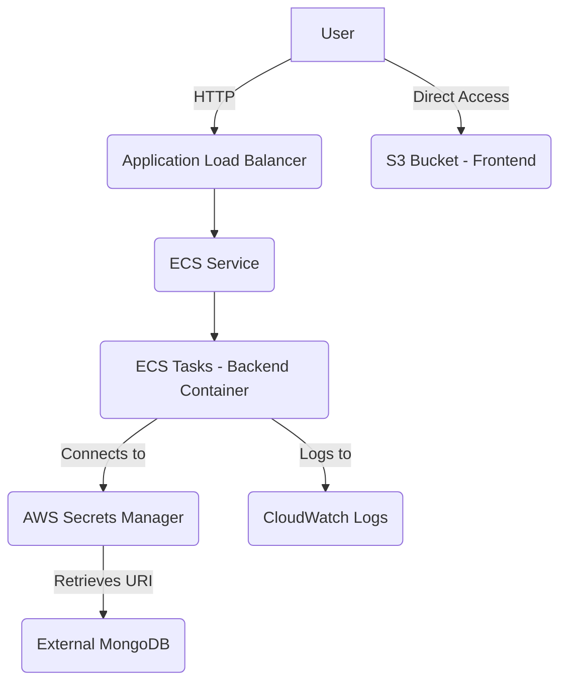

# **AWS Deployment for Support Bot**

This document outlines the AWS infrastructure setup for the `support-bot` project using OpenTofu. The infrastructure is designed to follow AWS best practices with proper security configurations.

## **Architecture Overview**

The deployment consists of the following components:

- **Frontend**: Hosted in an S3 bucket configured for static website hosting.
- **Backend**: Containerized Express.js API running on ECS Fargate.
- **Database**: **External MongoDB** (connection string stored in AWS Secrets Manager). This infrastructure **does not** provision the MongoDB instance itself; it assumes you have a separate MongoDB database running elsewhere and you provide its connection string.
- **Networking**: Custom VPC with public and private subnets.
- **Security**: IAM roles with least privilege, security groups, and encrypted secrets.



## **Prerequisites**

Before deploying, you need:

1. AWS account with appropriate permissions.
2. AWS CLI installed and configured.
3. GitHub repository set up with required secrets for the deployment workflows:
    - `AWS_ACCESS_KEY_ID`
    - `AWS_SECRET_ACCESS_KEY`
    - `AWS_REGION` (defaults to eu-west-2)
    - `TF_VAR_mongodb_uri` (The connection string for your external MongoDB database)
    - `TF_VAR_N8N_WEBHOOK_URL` (Production n8n webhook URL)
    - `TF_VAR_CLEANUP_API_KEY` (API key for cleanup endpoints)
    - `TF_VAR_N8N_ENCRYPTION_KEY` (Encryption key for n8n)

## **Deployment Process**

The deployment is orchestrated by GitHub Actions workflows located in the `.github/workflows/` directory. The primary pipeline is defined in `main-deploy.yml`.

### **Initial Infrastructure Setup**

The base AWS infrastructure (VPC, S3, ECR, ECS cluster, Secrets Manager) is provisioned using OpenTofu.

1. The infrastructure deployment is managed by the `terraform-apply.yml` GitHub Actions workflow.
2. This workflow is typically triggered **manually** via the GitHub Actions UI.
3. It initializes OpenTofu, creates/configures the S3 backend for state and DynamoDB for locking, validates the configuration, generates a plan, and applies the changes to provision the AWS resources.
4. After the initial deployment, note the key outputs defined in `./infra/outputs.tf`, such as the ALB DNS name, S3 bucket name, and ECR repository URL.

### **Application Deployment**

Once the infrastructure is in place, the backend and frontend applications can be deployed. The `main-deploy.yml` workflow automates this process.

1. Pushing changes to the `main` branch of the repository triggers the `main-deploy.yml` workflow.
2. This workflow orchestrates the deployment of the backend and frontend components by calling the `backend-deploy.yml` and `frontend-deploy.yml` workflows.
3. The pipeline includes logic to check for changes in the `backend/` and `frontend/` directories (using markers stored in S3) and will skip deploying a component if no relevant files have changed since the last successful deploy.
4. The `backend-deploy.yml` workflow builds the Docker image for the backend, pushes it to ECR, and updates the ECS service to use the new image.
5. The `frontend-deploy.yml` workflow builds the React application and syncs the static files to the S3 bucket configured for website hosting.

## **Infrastructure Details**

The OpenTofu code in the `./infra` directory defines the following AWS resources:

### **VPC and Networking**

- Custom VPC with a `10.0.0.0/16` CIDR block.
- Public subnets for load balancers and NAT gateways.
- Private subnets for ECS tasks (Fargate).
- Internet Gateway and NAT Gateways for outbound internet access from private subnets.
- Security groups to control traffic flow to the ALB and ECS tasks.

### **S3 for Frontend**

- An S3 bucket configured for static website hosting.
- Public read access is enabled for the bucket policy to serve the frontend files.
- CORS is configured to allow the frontend to be accessed from web browsers.

### **ECS for Backend**

- An ECS cluster using Fargate launch type for serverless container execution.
- Backend tasks run in private subnets for enhanced security.
- Configured with CPU and memory limits, and auto-scaling can be added based on demand.
- An Application Load Balancer (ALB) is set up to distribute incoming HTTP traffic to the backend service.
- Task definitions are configured to pull the backend Docker image from ECR and inject necessary environment variables as secrets from AWS Secrets Manager.

### **Secrets Management**

- AWS Secrets Manager is used for securely storing sensitive configuration data required by the backend application.
- A single secret is used to store multiple environment variables in **JSON format**. The ECS task definition is configured to read this secret and expose the key-value pairs as environment variables to the backend container.
- Example JSON structure for the secret value:
    
    ```
    {
      "DATABASE_URL": "your_external_mongodb_connection_string",
      "N8N_WEBHOOK_URL": "your_production_n8n_webhook_url",
      "CLEANUP_API_KEY": "your_chosen_cleanup_api_key",
      "N8N_ENCRYPTION_KEY": "your_n8n_encryption_key",
      "NODE_ENV": "production"
      // Add any other required backend environment variables here
    }
    
    ```
    
- IAM roles are configured to grant the ECS tasks permission to retrieve secret values from Secrets Manager.

## **Access and Security**

- Access to the backend API is primarily through the ALB endpoint.
- The frontend is accessed via the S3 static website endpoint.
- ECS tasks run in private subnets with no direct SSH access.
- Security groups restrict inbound traffic to necessary ports (80, 443 on ALB, container port on ECS tasks only from ALB).
- IAM roles follow the principle of least privilege.

## **Monitoring and Logs**

- Container logs from ECS tasks are sent to AWS CloudWatch Logs.
- CloudWatch Metrics are available for monitoring ECS task performance and ALB traffic.
- ECS service health checks are configured via the ALB target group.

## **Cost Optimization**

This setup is designed with cost-effectiveness in mind:

- Fargate is a serverless compute engine, meaning you only pay for the CPU and memory resources consumed by your tasks.
- S3 hosting for the static frontend is very cost-effective.
- NAT Gateways represent a significant ongoing cost; their necessity is driven by the requirement for tasks in private subnets to access the internet (e.g., for calling external APIs, fetching updates).

## **Customization**

You may need to customize the deployment for production use cases:

1. **Domain Names and HTTPS Certificates:** The base setup configures the ALB with an **HTTP listener only** on port 80. Setting up a custom domain name and enabling HTTPS requires:
    - Registering a domain name.
    - Creating an ACM certificate for your domain.
    - Adding an HTTPS listener on the ALB (port 443) and associating the certificate.
    - Updating DNS records (e.g., using Route 53) to point your domain to the ALB.
2. Additional environment variables in the Secrets Manager.
3. Auto-scaling settings for ECS tasks based on load metrics.
4. Setting up a CloudFront distribution in front of the S3 bucket for better frontend performance, caching, and HTTPS.

## **Troubleshooting**

- Check the execution logs of the GitHub Actions workflows (`main-deploy.yml`, `terraform-apply.yml`, `backend-deploy.yml`, `frontend-deploy.yml`) for deployment failures.
- Review CloudWatch Logs for the backend ECS service for application-level errors.
- Verify IAM permissions if you encounter access denied errors.
- Ensure your external MongoDB instance is running and accessible from the AWS VPC (specifically from the private subnets where ECS tasks run). Check security groups and network ACLs if necessary.
- If using `tofu destroy` manually, ensure your AWS CLI is configured with the correct credentials and region.

## **Cleanup**

To avoid incurring ongoing AWS charges, it is important to destroy the provisioned resources when they are no longer needed.

- The current recommended method for cleanup is to use the OpenTofu CLI. Navigate to the `./infra` directory in your terminal and run:
    
    ```
    tofu destroy
    ```
    
- Review the plan carefully before confirming the destruction.
- `*Note: The terraform-apply.yml workflow includes a commented-out or conditional step for destruction, but automated cleanup via the workflow is a future enhancement.*`

## **Security Considerations**

- Secrets are managed via AWS Secrets Manager and are not stored directly in code or OpenTofu state files.
- ECS containers run with minimal necessary IAM permissions.
- Network security is enforced using VPC, subnets, and security groups.
- Regularly update the Docker image for the backend application to include the latest security patches.

## **Why OpenTofu?**

This project utilizes OpenTofu instead of HashiCorp Terraform. This choice reflects a commitment to open source principles and is a response to HashiCorp's change in licensing for future Terraform releases. OpenTofu provides a community-driven, open-source alternative that is compatible with existing Terraform providers and state files.